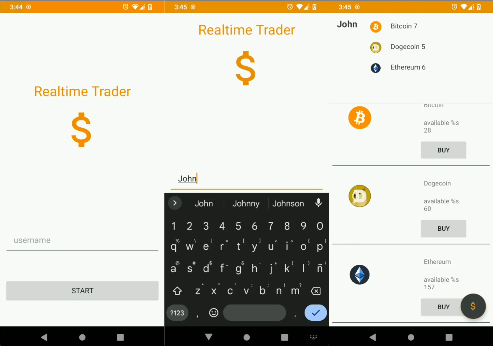
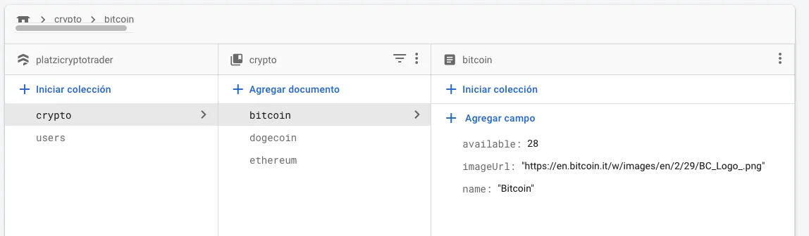

# Android Kotlin Firestore App - Crypto

This Android app its the result of the *android-firestore-platzi-crypto-trade* course from Platzi Academy.

This Android/Kotlin app was forked from another github project. Uses Firebase services to authenticate users and to retrieve fake crypto data. With Firestore, the app creates users and manages its coins. Every app instance subscribes to Firestore to listen for data changes in realtime.

## Instructions

1. Clone this repository in your machine
2. Create a Firebase project with your Google account
3. Download the *google-services.json* file after add a new app in Firebase
4. In Firebase, configure the Firestore service, using the structure below:
   
   1. cryptos: a collection of crypto coins with three fields:
      - name
      - available
      - imageUrl
   2. users: this collection is managed by the app
5. Build the app using Android Studio
6. Use it

## License
MIT

## About the author
*[Jhonyfer's blog](https://viejony.github.io/blog/en)*